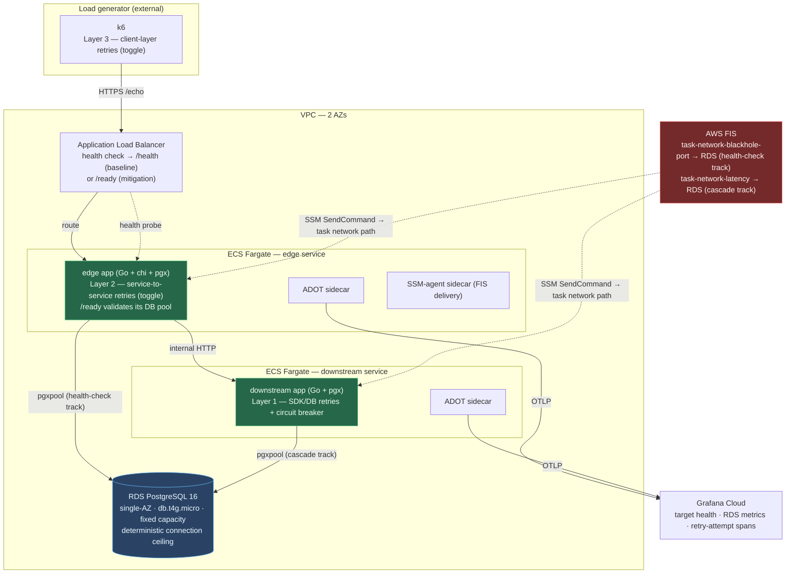
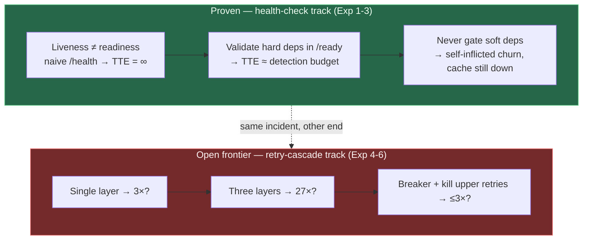

# Cascade Resilience Atelier

_Architecture, Decisions, and Findings · Work in Progress · July 2026_

> **A `/health → 200` that validates nothing is a fail-silent failure mode, and the uncoordinated retries of the dead target it protects are a fail-slow one — the same incident seen from two ends.** A load balancer keeps routing to a functionally dead task because its health check tells the truth about the *process* and lies about the *service*; meanwhile each layer's retries multiply load on the innermost dependency by up to 27× (3 × 3 × 3). This atelier deploys a real ALB → ECS Fargate → RDS system and measures both ends empirically, against predictions committed before any infrastructure existed.

This is the canonical documentation for the repository. It captures the architectural decisions made before the codelab was implemented, the empirical findings produced by running each module on real AWS infrastructure, and — because this work is **still in progress** — an honest ledger of what has been proven, what is pre-registered but not yet run, and what remains unwritten. The code in this repository is the implementation; the companion `constellational_atelier` Obsidian vault is the long-form curriculum (one document per module); this document is the synthesis-so-far.

---

## Status

**Work in progress — July 2026.** The codelab is an eight-module arc: two foundation modules build the apparatus (01–02), then the experiment work splits into two independent tracks that share the apparatus — a **health-check track** (03 → 04 → 05) and a **retry-cascade track** (06 → 07 → 08).

| Track | Module | Experiment | State |
|---|---|---|---|
| Foundation | 01 Baseline | — | ✅ Complete |
| Foundation | 02 Apparatus | — | ✅ Complete |
| Health-check | 03 Health-Check Mythology | Exp 1 — failure | ✅ Complete · **verdict CONFIRMED** |
| Health-check | 04 Hard-Dependency Validation | Exp 2 — mitigation | ✅ Complete · **verdict CONFIRMED** (mechanism) |
| Health-check | 05 Soft-Dependency Boundary | Exp 3 — converse trap | ✅ Complete · **verdict CONFIRMED** |
| Retry-cascade | 06 Retry Cascade, Single Layer | Exp 4 — failure | 🚧 Pre-registered, run pending |
| Retry-cascade | 07 Retry Cascade, Multi Layer | Exp 5 — the 27× claim | ⬜ Not started |
| Retry-cascade | 08 Cascade Mitigation | Exp 6 — mitigation | ⬜ Not started |

**The health-check track is complete and its three verdicts are in.** The retry-cascade track is the open frontier: Module 06 is fully pre-registered (prediction, apparatus, fault transport) but not yet run, and Modules 07–08 — including the headline **27× amplification** claim — are written into the prediction spine but not yet executed. This README will be revised as those verdicts land. CI/CD was deliberately descoped (see Decision 9).

---

## Thesis

The atelier tests, empirically and against pre-registered predictions, that the health-check gap and the retry-amplification cascade are the *same incident* seen from two ends. A health check that does not validate its dependencies keeps a dead target in rotation (fail-silent); the downstream retries of that dead target multiply load on the innermost dependency (fail-slow). The apparatus deploys one real ALB → ECS Fargate → RDS system and measures both ends: **time-to-evict (TTE)** and **instance-replacement counts** on the health-check track, and **DB-call-attempt amplification** on the cascade track. Every prediction below was committed before the corresponding infrastructure existed; the findings are the receipts, and the falsifiers are stated up front.

---

## Context

The codelab was scoped to satisfy four constraints that are in tension:

1. **Didactic fidelity** — the experiments must make the health-check gap, hard-vs-soft dependency boundaries, and retry amplification visible as observable phenomena in a dashboard, not asserted in prose. Every retry must be a literal `for` loop the reader can count, and a countable OpenTelemetry span.
2. **Falsifiability** — each experiment carries a pre-registered numeric prediction, a noise band, and a falsifier committed before the run. A finding that lands outside its band is a result, not a failure to hide.
3. **Cost discipline** — resources must be destroyable after each module. Fargate runs in public subnets (no NAT Gateway), the DB is the smallest instance class, and FIS incurs no idle cost. Full-codelab cost stays in the single-digit dollars with disciplined teardown.
4. **Determinism over realism** — the measurement substrate must yield the *same* signal across ≥ 3 repetitions. A capacity that autoscales under load would mask the cascade, so the DB is fixed-capacity single-AZ by design.

Each decision below documents how a specific tension was resolved. Each finding documents what the resolution actually delivered when run against real AWS infrastructure in `us-east-1`.

---

## System Architecture



**Why two Fargate services.** The headline 27× prediction requires three *independent* retry layers: the k6 client (Layer 3), the edge → downstream hop (Layer 2), and the downstream → RDS call (Layer 1). A single service can only demonstrate the single-layer 3× multiplier (Experiment 4); the second service is what makes the multi-layer cascade (Experiment 5) real rather than simulated. The full two-service topology lands with the cascade track (Modules 06–08); the health-check track (03–05) exercises the edge service and its DB pool.

**Why FIS reaches the task through SSM.** FIS's `aws:ecs:task` network actions are *not* endpoint-only. Every fault is delivered via an **SSM-agent sidecar** that registers the task as an SSM Managed Instance; `enableFaultInjection` on the task definition opens the fault endpoints, but `ssm:SendCommand` is the delivery channel (see Decision 8). This is the single most consequential build-time correction in the project.

---

## Decisions

The full prospective rationale (Context · Considered Options · Trade-offs · Rejected) lives in the companion vault's `00-architecture-and-decisions.md` (ADR-CRA-001…012, MADR format). The compact summary below pairs each decision with its principal rejected alternative and — where the consequence only emerged during implementation — a post-hoc note.

| # | Decision | Choice | Principal rejected alternative | Post-hoc consequence |
|---|---|---|---|---|
| 1 | App language + framework | Go 1.26 + chi + pgx (`pgxpool`) | Java + Spring + resilience4j (annotations *hide* the retries the codelab exists to expose); Python + FastAPI (asyncio/GIL p99 confounder) | Every retry is a literal `for` loop the reader can count, and one OTel span per DB attempt — the amplification is provable, not inferred |
| 2 | Build tool | `go mod` + `go build` | A separate task runner | — |
| 3 | Infra-as-code | AWS CDK v2, **TypeScript** | CDK Go (jsii `jsii.String(...)` ceremony buries intent); Terraform | Polyglot repo (Go app `app/`, TS infra `cdk/`); FIS is L1 `CfnExperimentTemplate` in every binding, so TS wins purely on ECS/ALB/RDS readability |
| 4 | Container runtime | ECS Fargate | EC2 (capacity to manage) | Task defs must carry `enableFaultInjection`, `pidMode: task`, explicit `runtimePlatform` — and an SSM sidecar (Decision 8) |
| 5 | Database | RDS PostgreSQL 16, single-AZ, `db.t4g.micro`, fixed capacity | Aurora Serverless v2 — ACU autoscaling *masks* contention by adding capacity mid-experiment | Deterministic connection ceiling → pool exhaustion and the cascade are reproducible across ≥ 3 reps |
| 6 | Observability | ADOT + Grafana Cloud + CloudWatch Logs Insights | X-Ray-only; CloudWatch-only | Amplification = a count of `db_attempt` log lines per `request_id`; **`count_distinct` is approximate — the query must group-by-then-count** (baseline read 1.09 wrong vs 1.00 right) |
| 7 | Load testing | k6 (`scenarios` API) | JMeter; Locust | k6's client-side retry IS Layer 3 of the 27× — an experimental variable, not a fixture |
| 8 | Chaos engineering | AWS FIS `aws:ecs:task` network actions — **blackhole-port** (health-check track) / **latency** (cascade track) | Server-side throttle (static config, not injectable/reversible) | **Corrected after the M02 deploy:** faults require the full SSM machinery — a 3rd per-task sidecar, a managed-instance role, task-role + FIS-role SSM grants, and a `LastStatus=RUNNING` target filter — else every run fails pre-flight with *"not registered as a SSM managed instance."* Latency (not blackhole) on the cascade track so RDS genuinely receives the amplified attempts |
| 9 | CI/CD | **Rejected — out of scope** | GitHub Actions + OIDC + six-layer fork isolation | Experiments are deployed, run, and measured by hand, one controlled run at a time; a pipeline adds a public-repo attack surface for zero experimental gain |
| 10 | Local toolchain | Docker + Compose only on host | Dev Containers; Nix | `~/.aws` mounted **`:rw`** so the SDK can refresh the cached SSO token |
| 11 | Circuit breaker | `sony/gobreaker` | Hand-rolled ~80-line breaker; a larger framework | The breaker's `closed/open/half-open` state machine *is* the Module 08 teaching payload — reading its source is the lesson |
| 12 | Health endpoint envelope | `/health` (liveness, validates nothing) + `/ready` (hard-deps-only readiness) | A single endpoint | One apparatus, three pedagogical states, one knob: which endpoint the ALB probes and what `/ready` validates. Gating a soft dep (cache) in `/ready` is the converse trap (Exp 3) |

---

## Predictions (pre-registered)

Every experiment's prediction, noise band, and falsifier were committed in the execution plan's effect-size spine *before* the run. This is the falsifiability contract — the operational metric for Modules 06–08 was later refined from "RDS QPS ratio" to "DB-call-attempt *count* ratio" (a rate dilutes and undercounts the cascade), but the predicted values and falsifier bounds are unchanged from pre-registration.

| Exp | Module | Predicted quantity | Prediction | Falsifier |
|---|---|---|---|---|
| 1 | 03 | Time-to-evict, naive `/health` | **TTE = ∞** (target stays "healthy" ≥ 30 min) | any finite TTE |
| 2 | 04 | Time-to-evict, `/ready` (DB pool) | **TTE ≈ 30 s** (interval 5 s × threshold 6), ± 5 s | TTE ≫ 30 s → a masking layer |
| 3 | 05 | Instance replacements per cache-outage burst | **≥ 1** (soft-dep-as-hard arm); **0** (correct arm) | 0 in treatment arm |
| 4 | 06 | DB-attempt amplification (1 layer × 3) | **3.0×** ± 15% | < 2.5× or > 3.5× (a hidden retry layer) |
| 5 | 07 | DB-attempt amplification (3 layers × 3) | **27×** ± 25% — *the headline claim* | < 15× or > 40× |
| 6 | 08 | DB-attempt amplification (breaker + kill upper retries) | **≤ 3×** | > 5× |

---

## Empirical Findings

Direct measurements from `us-east-1`, not estimates. Rows for un-run experiments carry the prediction only.

| Module | Configuration | Prediction | Measured | Verdict |
|---|---|---|---|---|
| **01 Baseline** | ALB → Fargate → RDS · naive `/health → 200` · no retries | (control) | Deployed; `/health` returns 200 validating no dependency — the anti-baseline | — |
| **02 Apparatus** | + `db_attempt` instrumentation · ADOT + SSM sidecars · FIS templates · k6 | baseline amp = 1.0 | **1.00** (group-by-`request_id` count; `count_distinct` mis-read 1.09) | — |
| **03 Exp 1 — Health-Check Mythology** | ALB probes `/health` · FIS **blackholes** the DB | TTE = ∞ | **TTE = ∞** across 3 reps — `HealthyHostCount` flat at 2.0 the whole ≥ 30-min window while `5XX` climbed to ~570/min; k6 failure 4.93 / 16.08 / 11.13% | ✅ **CONFIRMED** |
| **04 Exp 2 — Hard-Dependency Validation** | ALB probes `/ready` (DB-pool ping) · same fault | TTE ≈ 30 s ± 5 | **mean 38.3 s** (reps 39.4 / 40.1 / 35.5) = ~9.2 s SSM fault-delivery + ~26.3 s ALB detection (exactly 6 probes × 5 s) | ✅ **CONFIRMED** (mechanism); fail-open secondary **falsified** |
| **05 Exp 3 — Soft-Dependency Boundary** | `/ready` mis-gates the cache as hard · cache blackholed | ≥ 1 replacement / burst | control **0**, treatment **2 / 2 / 4** replacements (*"Task failed ELB health checks"*); `/echo` **99.98%** available in *both* arms | ✅ **CONFIRMED** |
| **06 Exp 4 — Retry Cascade, Single Layer** | 1 layer × 3 attempts · FIS **latency** > per-attempt timeout | 3.0× ± 15% | run pending — apparatus + prediction committed, reps not yet run | 🚧 |
| **07 Exp 5 — Retry Cascade, Multi Layer** | 3 independent layers × 3 | 27× ± 25% | not started | ⬜ |
| **08 Exp 6 — Cascade Mitigation** | `sony/gobreaker` + kill the upper retry layers | ≤ 3× | not started | ⬜ |

### Per-module commentary (completed modules)

- **M01 — Baseline is the anti-baseline.** A single Go edge service behind an ALB, backed by a fixed-capacity single-AZ RDS instance, with a naive `/health → 200` that validates nothing downstream and a DB-touching `/echo`. No retries, no breaker. This is the control the health-check track perturbs. Three deviations from the plan's prose were recorded honestly (public not private subnets; one service not two at this stage; a cohesive repo layout).
- **M02 — The apparatus, corrected after a real deploy.** The shared instrument: one `db_attempt` structured log line (and OTel span) per DB attempt — counting these per `request_id` in a fault window *is* the amplification metric. The task grew to three containers (app + ADOT + SSM-agent) once the FIS/SSM machinery proved mandatory. The measurement-source table pins each quantity to its home: amplification ← Logs Insights, TTE ← `HealthyHostCount`, replacement count ← ECS task-state. Headline fact: **the baseline amplification read exactly 1.00 once the query grouped-then-counted rather than `count_distinct`-ing.**
- **M03 — The health check told the truth about the process and lied about the service.** With the ALB probing naive `/health` and FIS blackholing the DB, the target was **never evicted** — `HealthyHostCount` held flat at 2.0 for the entire ≥ 30-minute window while `HTTPCode_Target_5XX_Count` climbed to ~570/min and `/echo` returned 500s throughout. A control run served 644k requests at 0.00% failure. **TTE = ∞, as predicted. That gap between a healthy-looking process and a dead service is the mythology.**
- **M04 — Hard-dependency validation works — and ECS self-heals per-task faults.** Retargeting the ALB at `/ready` (which pings the DB pool) evicted the target at a **mean TTE of 38.3 s**, decomposed into ~9.2 s of SSM fault-delivery latency plus ~26.3 s of ALB detection (exactly the 6-probe × 5-s budget). The detection *mechanism* is in-band and confirmed. But the pre-registered "fail-open, 5xx persists" secondary was **falsified**: because the FIS fault is *per-task*, ECS replaced each blackholed task with a healthy one that reached the DB, and the service **recovered** — a 23-minute k6 run across all three faults failed just 0.84%. Carried forward: *Module 05 must inject its cache fault cache-side, or the storm will self-heal.* A bonus lesson — rep 1's eviction was erased entirely by 60-s metric smoothing while a 2-s poll caught it: **match instrument resolution to effect size.**
- **M05 — The converse trap: a survivable outage turned into self-inflicted churn.** Mis-gating the soft cache dependency inside `/ready` (as if it were hard) and then failing the cache produced **2 / 2 / 4 instance replacements** per treatment rep (attributed to *"Task failed ELB health checks"*) against **0** in the correctly-designed arm — and the replacements kept arriving 9+ minutes into the fault, proving the storm is **non-self-healing**. The punchline: `/echo` stayed **99.98%** available in *both* arms — **the cache outage was fully survivable, and gating it as a hard dependency converted it into needless, self-inflicted fleet churn that never fixes the cache.**

---

## Synthesis — Takeaways so far

The health-check track is complete; the cascade track is the open frontier. These takeaways are the ones the evidence already supports.



**1. Liveness is not readiness, and the difference is a fail-silent outage.** A `/health` that reports only "the process is up" keeps a functionally dead task in the load balancer's rotation indefinitely (TTE = ∞, M03). The failure is invisible precisely because the signal everyone trusts stays green.

**2. Validating the hard dependency in `/ready` closes the gap — at the cost of the detection budget.** Probing a real DB-pool check evicts the dead target in ≈ one health-check budget (M04). The mechanism is deterministic; the wall-clock TTE also carries the fault-delivery latency of whatever injects the failure, so *measure end-to-end and know what each term is.*

**3. Gating a soft dependency as if it were hard is the converse trap.** Including a cache in `/ready` converts a fully survivable outage (99.98% available) into a self-inflicted, non-self-healing replacement storm that never fixes the cache (M05). Hard dependencies belong in the readiness check; soft ones never do.

**4. Instrument resolution must match effect size.** A 60-s metric roll-up erased an eviction that a 2-s poll caught (M04). Determinism in the substrate is worthless if the measurement smears the signal away.

**5. Pre-registration turns surprises into findings, not embarrassments.** Every prediction here carried a band and a falsifier committed before the run. That is why M04's falsified fail-open secondary is a documented result — with a mechanism (per-task ECS self-heal) — rather than a quietly-dropped expectation. Refining the M06–08 metric from a QPS *rate* to an attempt *count* was an operational-definition fix, explicitly *not* a goalpost move.

**6. The headline is still a hypothesis.** The 27× cascade (M07) is written into the prediction spine and nothing more. Module 06 must first confirm the single-layer 3× *and rule out a hidden retry layer* (the > 3.5× falsifier) before the multi-layer math is trustworthy. This section will be rewritten when those verdicts land.

---

## Companion Documentation

The long-form module walkthroughs — full procedural steps, all CDK code, every CloudWatch Logs Insights query, the empirical numbers above with their full provenance, and an extensive pitfalls catalogue — live in the companion **`constellational_atelier`** Obsidian vault under `Cascade Resilience Atelier/`:

- `CASCADE_RESILIENCE_ATELIER_EXECUTION_PLAN.md` — task register, module dependency map, and the pre-registered effect-size spine (Section VII).
- `00-architecture-and-decisions.md` — the full prospective decisions document (ADR-CRA-001…012, MADR format).
- `01-baseline-deployment.md` … `06-retry-cascade-single-layer.md` — one document per module (Modules 07–08 pending).

The code in this repository is the implementation. The atelier is the curriculum. This document is the synthesis-so-far.

---

## Run It Yourself

Prerequisites: Docker 24+ with Compose v2; AWS CLI v2 configured with SSO (profile `cascade-resilience-atelier`); an AWS account with CDK bootstrapped in `us-east-1`. Nothing else runs on the host — Go, the AWS CDK CLI, k6, and the AWS CLI all live in containers (`docker-compose.yml`). `~/.aws` is mounted read-write so the SDK can refresh the SSO token.

```bash
git clone https://github.com/ae-lexs/cascade-resilience-atelier.git
cd cascade-resilience-atelier
aws sso login --profile cascade-resilience-atelier

# Build the Go edge service and deploy the two stacks
docker compose run --rm build go build ./...
docker compose run --rm cdk cdk deploy CascadeBaseline --require-approval never
docker compose run --rm cdk cdk deploy CascadeApparatus --require-approval never

# Drive load at the ALB (URL is a CascadeBaseline stack output)
docker compose run --rm -e ALB_URL="http://<alb-dns>" build \
  sh -c 'k6 run loadtest/sustained.js'
```

The apparatus stack carries the FIS experiment templates; trigger an experiment from the FIS console (or `aws fis start-experiment`) during a k6 run, then read the verdict with the queries in `observability/queries/` (`tte.cwli`, `db-attempt-amplification.cwli`, `instance-replacement.cwli`). `cdk destroy CascadeApparatus CascadeBaseline` tears everything down — FIS has no idle cost, so the standing spend is only ALB + RDS + Fargate. **Deployment is manual by design (Decision 9): there is no CI/CD pipeline.**

---

## References

| Source | Publisher | URL |
|---|---|---|
| Implementing health checks — David Yanacek | Amazon Builders' Library | https://aws.amazon.com/builders-library/implementing-health-checks/ |
| Timeouts, retries, and backoff with jitter — Marc Brooker | Amazon Builders' Library | https://aws.amazon.com/builders-library/timeouts-retries-and-backoff-with-jitter/ |
| AWS FIS — `aws:ecs:task` actions | AWS FIS User Guide | https://docs.aws.amazon.com/fis/latest/userguide/ecs-task-actions.html |
| Testing network resilience of Fargate workloads with FIS | AWS Containers Blog | https://aws.amazon.com/blogs/containers/testing-network-resilience-of-aws-fargate-workloads-on-amazon-ecs-using-aws-fault-injection-service/ |
| Use fault injection with ECS / Fargate | AWS ECS Developer Guide | https://docs.aws.amazon.com/AmazonECS/latest/developerguide/fault-injection.html |
| Health checks for ALB target groups (interval/threshold ranges) | AWS ELB User Guide | https://docs.aws.amazon.com/elasticloadbalancing/latest/application/target-group-health-checks.html |
| RDS PostgreSQL — connection limits / `max_connections` | AWS RDS User Guide | https://docs.aws.amazon.com/AmazonRDS/latest/UserGuide/CHAP_PostgreSQL.html |
| AWS CDK v2 Developer Guide | AWS | https://docs.aws.amazon.com/cdk/v2/guide/home.html |
| `pgx` · `chi` · `sony/gobreaker` | GitHub | https://github.com/jackc/pgx · https://github.com/go-chi/chi · https://github.com/sony/gobreaker |
| ADOT · k6 scenarios | AWS · Grafana Labs | https://aws-otel.github.io/ · https://grafana.com/docs/k6/latest/using-k6/scenarios/ |
| Principles of Chaos Engineering | — | https://principlesofchaos.org/ |

---

## License

MIT.

---

## Changelog

| Version | Date | Changes |
|---|---|---|
| v0.5 | July 2026 | Initial public README. Documents the eight-module arc with the health-check track (Modules 01–05 / Experiments 1–3) **complete** and its three verdicts CONFIRMED, and the retry-cascade track (Modules 06–08 / Experiments 4–6) pre-registered but **not yet run**. Includes the compact 12-row decisions table (Go + chi + pgx; CDK TypeScript; RDS single-AZ fixed-capacity; FIS `aws:ecs:task` with the corrected SSM-sidecar requirement; `/health`+`/ready` envelope; CI/CD rejected), the pre-registered prediction spine, the empirical-findings table with per-module commentary, and a synthesis-so-far that keeps the 27× cascade explicitly labeled a hypothesis. To be revised as the cascade-track verdicts land. |
