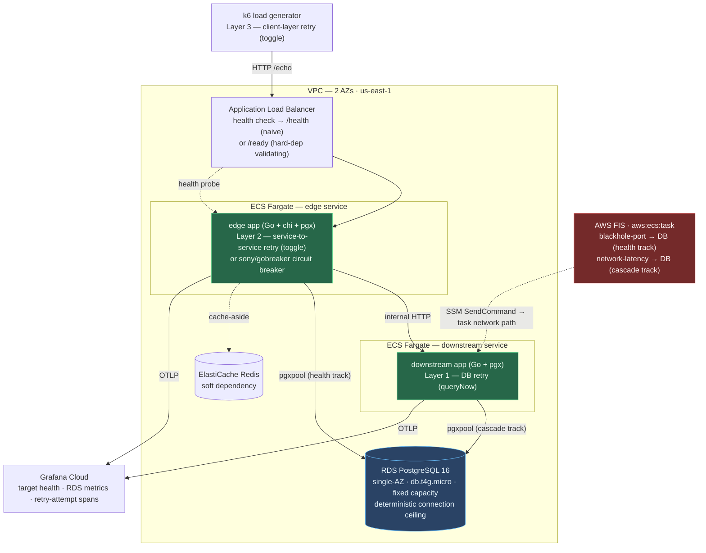

# Cascade Resilience Atelier

**An empirical study of the compute-resilience failure modes where a protective mechanism becomes a failure amplifier.**

_v1.0 · Author: Alexis Nava ([@ae-lexs](https://github.com/ae-lexs)) · Region of record: `us-east-1` · Status: Complete (eight-module arc — health-check + retry tracks)_

> **Thesis.** In compute, the resilience mechanism and the failure amplifier are frequently the *same object* — and which face you get is decided by **detection latency relative to how long the failure lasts.** A `/health → 200` that validates no dependency is a **fail-silent** failure mode; the uncoordinated retries of the dead target it keeps in rotation are a **fail-slow** one — the same incident seen from two ends. This repository deploys a real ALB → ECS Fargate → RDS system and measures both ends against predictions committed before any infrastructure existed.

---

## Table of contents

1. [Abstract](#1-abstract)
2. [Claims under test](#2-claims-under-test) — the citation surface
3. [Apparatus and method](#3-apparatus-and-method)
4. [Experiments and findings](#4-experiments-and-findings)
5. [Synthesis — eight takeaways](#5-synthesis--eight-takeaways)
6. [Design decisions](#6-design-decisions)
7. [Reproduce it yourself](#7-reproduce-it-yourself)
8. [How to cite](#8-how-to-cite)
9. [References](#9-references) · [License](#license) · [Changelog](#changelog)

---

## 1. Abstract

This is an **empirical study**, not a tutorial and not an opinion piece. Its unit of work is the *pre-registered experiment*: before any infrastructure was deployed, the expected effect size, a noise band, and a falsifier were committed to a prospective architecture-and-decisions document and an effect-size spine; the experiments were then run against real AWS infrastructure in `us-east-1`; and each load-bearing claim carries a **measured verdict** against that prediction.

Verdicts use three labels:

- **Confirmed** — the measurement matched the prediction within its pre-registered band.
- **Nuanced** — the direction held but the magnitude, cost, or boundary conditions differ materially from the naive expectation.
- **Corrected** — the measurement contradicted a stated assumption. *This is the highest-value outcome*: it is the reason to run the experiment instead of paraphrasing the documentation.

The study tests **six load-bearing claims** across two tracks — a health-check track (§VI of the AWS compute-resilience guidance) and a retry-cascade track (§VIII). Its headline is deliberately not folklore-overturning: **the canonical AWS guidance on compute resilience holds — quantitatively.** All six primary claims are **Confirmed**, including the widely-cited **27× retry cascade**, which landed at an exact 3 × 3 × 3. The value is in the two **Corrected** findings at the margin, where reality sharpened the doc: a hardened health check *detects* a dependency failure but does not by itself *recover* from it (detection ≠ recovery), and the resource metric an engineer instinctively reaches for to *see* retry amplification (`DatabaseConnections`) is **structurally blind** to it.

The arc is eight modules: M01–M02 build a deterministic apparatus (single ALB → Fargate → RDS, FIS-wired); M03–M05 are the health-check track (fail-silent, hard-dependency validation, the soft-dependency converse trap); M06–M08 are the retry-cascade track (single-layer 3×, the 27× cascade, and the mitigation that collapses it). The empirical findings in §4 are the receipts. What the study has **not** yet proven — the black-hole traffic effect, the AZ-failure timeline, and whether the cascade *latches* into a metastable state — is stated plainly in §2 as open questions rather than elided.

---

## 2. Claims under test

Each claim has a stable identifier (`CRA-NN`) so it can be cited directly. Follow the link for the experiment, the instrument, the measured number, and the reasoning behind the verdict. Predictions were committed before deployment in the companion vault's effect-size spine.

| ID | Claim under test | Prediction (pre-registered) | Measured result | Verdict |
|---|---|---|---|---|
| [CRA-01](#cra-01--a-fail-silent-health-check-never-evicts-the-dead-target) | A `/health → 200` that validates no dependency keeps the ALB routing to a degraded target | **TTE = ∞** (never evicted) | **TTE = ∞** across 3×30-min windows; `HealthyHostCount` flat at 2.0 while `Target_5XX` ~570/min | **Confirmed** |
| [CRA-02](#cra-02--validating-the-hard-dependency-detects-but-does-not-recover) | `/ready` with a DB-pool check evicts the target in `interval × threshold` | **≈ 30 s ± 5** (5 s × 6) | **38.3 s** (≈ 9.2 s SSM delivery + 26.3 s ALB detection) | **Confirmed** (mechanism) · **Corrected** secondary (fail-open *self-heals*, not persists) |
| [CRA-03](#cra-03--gating-a-soft-dependency-as-hard-manufactures-an-outage) | Gating a soft dependency in the health check converts a survivable outage into self-inflicted churn | **≥ 1 replacement/burst** (treatment); 0 (control) | treatment **2 / 2 / 4** replacements vs control **0**; `/echo` **99.98%** available in *both* arms | **Confirmed** |
| [CRA-04](#cra-04--one-retry-layer-triples-the-load-and-the-metric-cannot-see-it) | One retry layer × 3 attempts triples DB-call attempts on the innermost dependency | **3.0× ± 15%** | **2.94×** (histogram caps at exactly 3 — no hidden layer) | **Confirmed** · **Corrected** corroboration (`DatabaseConnections` is pool-blind) |
| [CRA-05](#cra-05--three-uncoordinated-layers-multiply-to-an-exact-3--3--3) | Three independent retry layers × 3 multiply to 27× — *the headline* | **27× ± 25%** | **26.4×** (every completed cascade an exact 3 × 3 × 3) | **Confirmed** |
| [CRA-06](#cra-06--constraining-where-retries-live-collapses-the-cascade) | Retry-at-closest-layer + a circuit breaker collapses amplification to ≤ 3× | **≤ 3×** | per-served **2.94×** (cap 3) + breaker sheds `/echo` to `503` @ ~0.13 s (~93% of requests) | **Confirmed** |

**Open questions — owed, not claimed.** Stated for honesty, these are testable but not yet run: the **black-hole problem** (a fast-*failing* target attracts *more* traffic than a healthy peer before eviction — §VI); the **AZ-failure timeline** and **static-stability arithmetic** (data-plane reroute in seconds vs. control-plane replacement in minutes — §VII/§IX, needs a 3-AZ apparatus); and whether the retry cascade **latches** into a metastable state that persists after the trigger is removed (this study measured the *amplifier*, and recovered on fault-lift; it did not demonstrate the *latch*).

---

## 3. Apparatus and method

### System under test

One deterministic stack, deployed from scratch per run and torn down after. The two application services run the **same Go binary**, switching behaviour on `SERVICE_ROLE` / `DOWNSTREAM_URL` / `EDGE_BREAKER`, so the topology is a configuration choice rather than a code fork — which is what keeps the workload constant across the single-layer and multi-layer experiments.



**Why fixed-capacity single-AZ RDS.** An autoscaling database (Aurora Serverless v2) would *mask* the cascade by adding capacity mid-experiment. A deterministic connection ceiling is what makes pool exhaustion and the amplification reproducible across ≥ 3 repetitions.

**Why FIS reaches the task through SSM.** FIS's `aws:ecs:task` network actions are *not* endpoint-only. Every fault is delivered via an **SSM-agent sidecar** that registers the task as an SSM Managed Instance; `enableFaultInjection` on the task definition opens the fault endpoints, but `ssm:SendCommand` is the delivery channel. This was the single most consequential build-time correction in the project (recorded as a doc-level correction in the companion vault).

### Instruments — how each number was measured

The measurement method is the load-bearing part of the study; a number without an instrument is an assertion. Every finding in §4 names the instrument that produced it.

| Instrument | Measures | Note on fidelity |
|---|---|---|
| **CloudWatch `GetMetricData`** — `HealthyHostCount` (`Minimum`, 60 s) | Time-to-evict (TTE); target-group health | 60 s resolution **cannot resolve a sub-minute transition** — for the ~30 s `/ready` detection window the primary instrument is the 2 s poll below (CRA-02). |
| **`describe-target-health` polled at 2 s** (CLI-captured) | The ~30 s eviction window at second resolution | Refined *to fit* the pre-registered quantity when the effect size shrank from ∞ (CRA-01) to ~30 s (CRA-02) — matching instrument resolution to effect size. |
| **CloudWatch Logs Insights** over `db_attempt` lines, `stats count(*) by request_id` | **DB-call-attempt amplification** — a *count ratio* (attempts per originating request) | **Not** an RDS QPS *rate* — a rate dilutes retries across the backoff window and undercounts the cascade. `count_distinct` is approximate (read 1.09 for a true 1.00); group-by-then-count is exact. |
| **`breaker_state` structured log lines** | The circuit breaker's `closed → open → half-open` timeline (CRA-06) | Emitted on every `gobreaker` state transition; the breaker's *engagement* is itself a measured quantity, not an assumption. |
| **CloudWatch `DatabaseConnections`** (`AWS/RDS`, 60 s) | Attempted corroboration of amplification | **Structurally blind**: pinned at the pgxpool ceiling (8) across 1× / 3× / 27× / shed, because the pool bounds concurrency (Little's Law). Plotted as the flat *control* line, never as a second amplification signal (CRA-04). |
| **k6 (`scenarios` API)** | throughput, `http_req_failed`, per-request timing under controlled load | The client-side retry toggle **is Layer 3** of the 27× — an experimental variable, not a fixture. |
| **AWS FIS `aws:ecs:task`** — `blackhole-port` / `network-latency` | The injected fault (DB unreachable vs. DB-path latency > timeout) | Latency (not blackhole) on the cascade track so RDS genuinely *receives* the amplified attempts; delivered via the SSM sidecar with a `LastStatus=RUNNING` target filter. |

---

## 4. Experiments and findings

Direct measurements from `us-east-1`, not estimates. Each subsection is a citable claim (`CRA-NN`).

#### CRA-01 — A fail-silent health check never evicts the dead target

With the ALB probing naive `/health` and FIS blackholing the DB port, the target was **never evicted**: `HealthyHostCount` held flat at **2.0** for the entire ≥ 30-minute window across three repetitions, while `HTTPCode_Target_5XX_Count` climbed to **~570/min** and `/echo` returned 500s throughout (k6 failure 4.93 / 16.08 / 11.13%). A control run served 644k requests at 0.00% failure. **TTE = ∞, as predicted** — the health check told the truth about the *process* and lied about the *service*. That gap is the mythology. **Verdict: Confirmed.**

#### CRA-02 — Validating the hard dependency detects, but does not recover

Retargeting the ALB at `/ready` (which pings the DB pool) evicted the target at a **mean TTE of 38.3 s** (39.4 / 40.1 / 35.5), decomposed into ~9.2 s of SSM fault-delivery latency plus ~26.3 s of ALB detection — exactly the 6-probe × 5 s budget. The detection *mechanism* is in-band and confirmed. But the pre-registered "fail-open, 5xx persists" secondary was **Corrected**: because the FIS fault is *per-task*, ECS replaced each blackholed task with a healthy one that reached the DB, and the service **recovered** (a 23-minute run across all three faults failed just 0.84%). **Detection ≠ recovery** — and a per-task fault self-heals, which reshaped every downstream experiment whose payload is a *storm*. A bonus, filed under the same lesson: rep 1's eviction was erased entirely by 60 s metric smoothing while the 2 s poll caught it. **Verdict: Confirmed (mechanism) · Corrected (secondary).**

#### CRA-03 — Gating a soft dependency as hard manufactures an outage

Mis-gating the soft cache dependency inside `/ready` (as if it were hard) and then failing the cache produced **2 / 2 / 4 instance replacements** per treatment rep (attributed to *"Task failed ELB health checks"*) against **0** in the correctly-designed arm — and replacements kept arriving 9+ minutes in, proving the storm is **non-self-healing** (it used a shared subnet-NACL fault, not the escapable per-task blackhole). The punchline: `/echo` stayed **99.98%** available in *both* arms. The cache outage was fully survivable; gating it as hard converted it into needless, self-inflicted fleet churn that never fixes the cache. **Verdict: Confirmed.**

#### CRA-04 — One retry layer triples the load, and the metric cannot see it

Wrapping the single DB call in a 3-attempt retry (backoff + full jitter, retryable-only gate) under a DB-path latency fault produced **mean 2.94×** amplification (2.96 / 2.96 / 2.91), baseline exact **1.00**. The **attempt histogram capped at exactly 3** (zero requests exceeded it), excluding the > 3.5× hidden-auto-retry falsifier and pinning the single-layer unit the cascade multiplies. The corroboration was **Corrected**: RDS `DatabaseConnections` stayed flat at the pgxpool ceiling (8) in *both* arms — a resource gauge is structurally blind to attempt amplification above a bounded pool (Little's Law), which only strengthens the count-ratio method. **Verdict: Confirmed · Corrected corroboration.**

#### CRA-05 — Three uncoordinated layers multiply to an exact 3 × 3 × 3

Stacking two more independent 3-attempt layers (edge → downstream, and the k6 client) on CRA-04's confirmed single layer produced **mean 26.4×** (25.2 / 27.0 / 27.0, enclosed-request measure), baseline exact **1.00**, every completed cascade decomposing as an exact **3 × 3 × 3**. The instrument was reused *verbatim* from CRA-04, made honest across three hops by **propagating one origin id** (`X-Request-Id` reused by chi's RequestID middleware; `traceparent` by otelhttp) so the denominator stays per-*originating*-request. The 27× is reachable only because every outer timeout is patient enough to let the inner cascade finish — precisely the uncoordinated anti-pattern the number describes. **The canonical headline claim, confirmed on real infrastructure. Verdict: Confirmed.**

#### CRA-06 — Constraining where retries live collapses the cascade

Deleting the two outer retry layers and gating the single edge → downstream call behind a `sony/gobreaker` circuit breaker (retaining only Layer 1, the retry *closest* to the failure) collapsed amplification from **26.4× → per-served mean 2.94×** (2.92 / 2.94 / 2.96, **cap 3 every rep** — no leaked outer retry), numerically identical to CRA-04's isolated single layer. The breaker did the second, distinct job: it tripped `closed → open` in all three reps (~12–18 s after the fault bit) and cycled `open ⇄ half-open` every ~10 s, shedding `/echo` to a fast **`503` @ ~0.13 s** (vs. the cascade's ~19–57 s) — **~93% of requests shed** away from the failing dependency, dropping the all-originating aggregate to ≈ 0.002×. The cascade is **bounded, not eliminated**: a retry rides out a *transient* blip, a breaker sheds a *sustained* outage; using retries for both is what built the 27×. **Verdict: Confirmed.**

---

## 5. Synthesis — eight takeaways

The two tracks are the same incident seen from two ends: a fail-silent health check keeps a dead target in rotation, and the retries into that target amplify load on the innermost dependency. Detection latency is the hinge.

1. **Liveness is not readiness, and the difference is a fail-silent outage.** A `/health` reporting only "the process is up" keeps a functionally dead task in rotation indefinitely (TTE = ∞, CRA-01). The failure is invisible precisely because the signal everyone trusts stays green.
2. **Validating the hard dependency closes the gap — but detection is not recovery.** `/ready` evicts the dead target in one health-check budget (CRA-02), yet the wall-clock TTE also carries the fault-delivery latency, and eviction alone does not restore service. Measure end-to-end, and know which term is which.
3. **Gating a soft dependency as hard is the converse trap.** It converts a fully survivable outage (99.98% available) into a self-inflicted, non-self-healing replacement storm that never fixes the dependency (CRA-03).
4. **Instrument resolution must match effect size.** A 60 s metric roll-up erased an eviction a 2 s poll caught (CRA-02). Determinism in the substrate is worthless if the measurement smears the signal away.
5. **Amplification is a count, not a rate — and a resource gauge can be blind to it.** One retry layer triples DB-call attempts (CRA-04); a QPS rate dilutes that across the backoff window, and `DatabaseConnections` cannot see it at all because the pool bounds concurrency (Little's Law). Count the attempt events at their source.
6. **Uncoordinated retries multiply, exactly.** Three independent layers compose to an exact 3 × 3 × 3 = 26.4× (CRA-05) — reachable only because every outer timeout is patient enough to let the inner cascade finish. A retry that absorbs a *transient* blip becomes a compounding amplifier under a *sustained* one.
7. **The cure is to constrain where retries live, not to remove them.** Keeping only the retry closest to the failure and adding a circuit breaker collapses 26.4× → 2.94× (CRA-06). The breaker does the job the outer retries were doing badly: under sustained failure it trips open and *sheds* instead of patiently retrying into a dependency that is already down.
8. **A load-shedding cure must be measured by decomposition, not the mean.** Once the breaker sheds, the aggregate amplification falls to ≈ 0 — which both undersells the result and could hide a leaked retry. The adjudicating measurement is the per-served cap (= 3) plus the shed fraction, not the shed-diluted average.

---

## 6. Design decisions

The full prospective rationale (Context · Considered Options · Trade-offs · Rejected) lives in the companion vault's `00-architecture-and-decisions.md` (ADR-CRA-001…012, MADR format). The compact summary pairs each decision with its principal rejected alternative and — where the consequence emerged only during implementation — a post-hoc note.

| # | Decision | Choice | Principal rejected alternative | Post-hoc consequence |
|---|---|---|---|---|
| 1 | App language + framework | Go 1.26 + chi + pgx (`pgxpool`) | Java + Spring + resilience4j (annotations *hide* the retries the study exists to expose); Python + FastAPI | Every retry is a literal `for` loop the reader can count, and one OTel span per DB attempt — amplification is provable, not inferred |
| 2 | Build tool | `go mod` + `go build` | A separate task runner | — |
| 3 | Infra-as-code | AWS CDK v2, **TypeScript** | CDK Go (jsii ceremony); Terraform | FIS is L1 `CfnExperimentTemplate` in every binding, so TS wins on ECS/ALB/RDS readability |
| 4 | Container runtime | ECS Fargate | EC2 (capacity to manage) | Task defs carry `enableFaultInjection`, `pidMode: task`, explicit `runtimePlatform`, and an SSM sidecar (Decision 8) |
| 5 | Database | RDS PostgreSQL 16, single-AZ, `db.t4g.micro`, fixed capacity | Aurora Serverless v2 — ACU autoscaling *masks* the cascade | Deterministic connection ceiling → pool exhaustion and amplification reproducible across ≥ 3 reps |
| 6 | Observability | ADOT + Grafana Cloud + CloudWatch Logs Insights | X-Ray-only; CloudWatch-only | Amplification = a count of `db_attempt` lines per `request_id`; **group-by, not `count_distinct`** (which read 1.09 vs a true 1.00) |
| 7 | Load testing | k6 (`scenarios` API) | JMeter; Locust | k6's client-side retry **is Layer 3** of the 27× — a variable, not a fixture |
| 8 | Chaos engineering | AWS FIS `aws:ecs:task` — **blackhole-port** / **latency** | Server-side throttle (not injectable/reversible) | **Corrected after deploy:** faults require the full SSM machinery — sidecar, managed-instance role, task/FIS SSM grants, `LastStatus=RUNNING` filter — else every run fails pre-flight |
| 9 | Circuit breaker | `sony/gobreaker` | Hand-rolled breaker; a larger framework | The `closed/open/half-open` state machine *is* the CRA-06 teaching payload; a static-threshold breaker is deliberately the simplest mechanism that demonstrates the collapse |
| 10 | CI/CD | **Rejected — out of scope** | GitHub Actions + OIDC | Experiments are deployed, run, and measured by hand, one controlled run at a time; a pipeline adds a public-repo attack surface for zero experimental gain |
| 11 | Local toolchain | Docker + Compose only on host | Dev Containers; Nix | `~/.aws` mounted **`:rw`** so the SDK can refresh the cached SSO token |
| 12 | Health endpoint envelope | `/health` (liveness) + `/ready` (hard-deps-only) | A single endpoint | One apparatus, three pedagogical states, one knob: which endpoint the ALB probes and what `/ready` validates |

---

## 7. Reproduce it yourself

Prerequisites: Docker 24+ with Compose v2; AWS CLI v2 with SSO (profile `cascade-resilience-atelier`); an account with CDK bootstrapped in `us-east-1`; a Grafana Cloud OTLP endpoint. Nothing else runs on the host — Go, the CDK CLI, k6, and the AWS CLI all live in containers. `~/.aws` is mounted read-write so the SDK can refresh the SSO token.

```bash
git clone https://github.com/ae-lexs/cascade-resilience-atelier.git
cd cascade-resilience-atelier
aws sso login --profile cascade-resilience-atelier

# Deploy the two-service stack (add -c breaker=true for the CRA-06 mitigation arm)
docker compose run --rm -e GRAFANA_OTLP_ENDPOINT cdk npx cdk deploy CascadeBaseline CascadeApparatus --require-approval never

# Drive load (RETRIES=2 arms the client-side Layer 3 for the 27× cascade)
docker run --rm -e ALB_URL="http://<alb-dns>" -e RETRIES=2 -v "$PWD/loadtest:/t" grafana/k6 run /t/cascade-trigger.js

# During the run, start a FIS experiment (template id is a CascadeApparatus output), then
# read the verdict with the amplification query (group-by request_id, not count_distinct).
aws fis start-experiment --experiment-template-id <DbLatencyTemplateId>
```

`cdk destroy CascadeApparatus CascadeBaseline` tears everything down; FIS has no idle cost, so standing spend is only ALB + RDS + Fargate. **Deployment is manual by design (Decision 10): there is no CI/CD pipeline.** The long-form module walkthroughs — every step, all CDK, every Logs Insights query, and the pitfalls catalogue — live in the companion `constellational_atelier` vault under `Cascade Resilience Atelier/` (one document per module, each with its run verdict in Section VII).

---

## 8. How to cite

Cite the study, or a specific claim by its stable identifier:

> Nava, A. (2026). *Cascade Resilience Atelier* (v1.0) [Empirical study]. GitHub. https://github.com/ae-lexs/cascade-resilience-atelier

For a single claim, reference its ID and heading — e.g. **CRA-05 (three uncoordinated retry layers multiply to an exact 3 × 3 × 3 = 26.4×)**. Each `CRA-NN` in §2 is a stable anchor. This atelier is the compute-substrate half of the **Resilience series**; its companion is the [Lambda Resilience Atelier](https://github.com/ae-lexs/lambda-resilience-atelier) (`LRA-NN`), which covers the Lambda concurrency and cold-start failure modes.

---

## 9. References

| Source | Publisher | URL |
|---|---|---|
| Implementing health checks — David Yanacek | Amazon Builders' Library | https://aws.amazon.com/builders-library/implementing-health-checks/ |
| Timeouts, retries, and backoff with jitter — Marc Brooker | Amazon Builders' Library | https://aws.amazon.com/builders-library/timeouts-retries-and-backoff-with-jitter/ |
| Using load shedding to avoid overload — David Yanacek | Amazon Builders' Library | https://aws.amazon.com/builders-library/using-load-shedding-to-avoid-overload/ |
| Static stability using Availability Zones — Colm MacCárthaigh | Amazon Builders' Library | https://aws.amazon.com/builders-library/static-stability-using-availability-zones/ |
| AWS FIS — `aws:ecs:task` actions | AWS FIS User Guide | https://docs.aws.amazon.com/fis/latest/userguide/ecs-task-actions.html |
| Health checks for ALB target groups | AWS ELB User Guide | https://docs.aws.amazon.com/elasticloadbalancing/latest/application/target-group-health-checks.html |
| `pgx` · `chi` · `sony/gobreaker` | GitHub | https://github.com/jackc/pgx · https://github.com/go-chi/chi · https://github.com/sony/gobreaker |
| AWS CDK v2 Developer Guide · k6 scenarios | AWS · Grafana Labs | https://docs.aws.amazon.com/cdk/v2/guide/home.html · https://grafana.com/docs/k6/latest/using-k6/scenarios/ |
| Principles of Chaos Engineering | — | https://principlesofchaos.org/ |

## License

MIT.

## Changelog

| Version | Date | Changes |
|---|---|---|
| v1.0 | July 2026 | **Citable empirical-study restructure — eight-module arc complete, all six primary claims Confirmed.** Reorganized from the narrative v0.x into the study format: an Abstract framing the work as pre-registered experiment with three verdict labels (Confirmed / Nuanced / Corrected); a **`CRA-NN` claim ledger** (§2) as the citation surface, with the two health-track corrections (detection ≠ recovery; `DatabaseConnections` pool-blindness) surfaced as `Corrected`; an Instruments table (how each number was measured); per-claim findings (§4, CRA-01…06); an eight-point synthesis; the 12-row decisions table; and a **How to cite** section pairing this atelier with the Lambda Resilience Atelier under the Resilience series. Open questions (black-hole, AZ-failure timeline, cascade metastability) stated as owed rather than elided. Numbers: TTE = ∞ (CRA-01); 38.3 s (CRA-02); 2/2/4 vs 0 (CRA-03); 2.94× (CRA-04); 26.4× exact 3×3×3 (CRA-05); 26.4× → 2.94× + 93% shed (CRA-06). |
| v0.6 | July 2026 | Retry-cascade track complete — Modules 06–08 verdicts (2.94× / 26.4× / 2.94×) folded into the narrative README; synthesis reframed from "open frontier" to proven. |
| v0.5 | July 2026 | Initial public README (health-check track complete; retry track pre-registered but not yet run). |

---

_The code in this repository is the implementation. The companion `constellational_atelier` vault is the curriculum (one document per module). This document is the citable synthesis._
